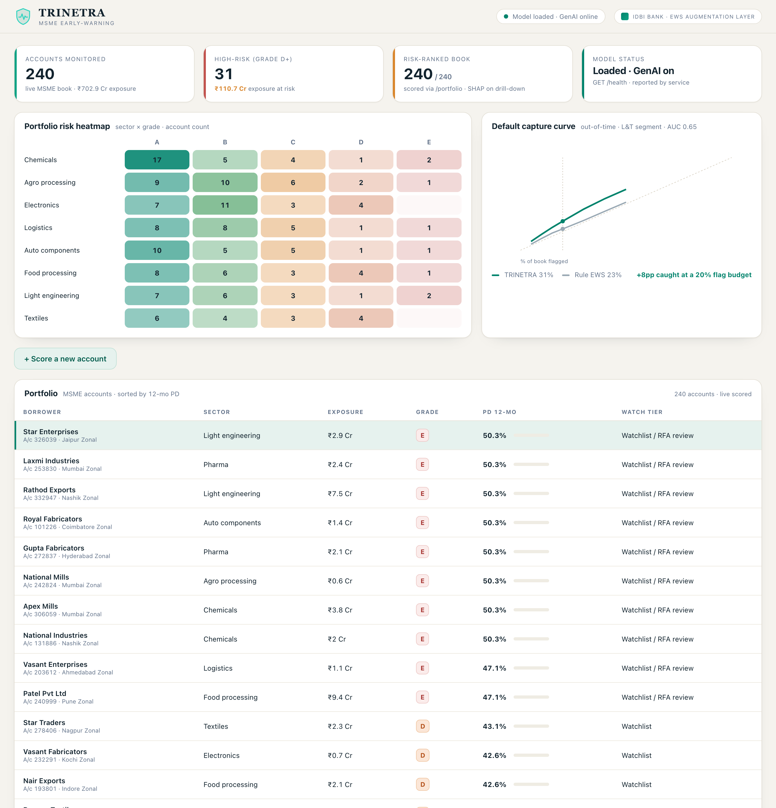

# TRINETRA — MSME Early-Warning Risk Engine

[](https://github.com/IHRM-AI/TRINETRA/actions/workflows/ci.yml)

**IDBI Innovate 2026 · Track 4 (Default Prediction Model)**

An ML + GenAI **augmentation layer** on the bank's existing rule-based Early-Warning System (EWS). It turns today's ~1-in-5 useful 12-month flags into a **calibrated, explainable probability of default** — every flag translated into RBI EWS-trigger language, every account one click from a human-approved credit memo.

> Augmentation, never replacement. TRINETRA ingests the existing ~80-trigger EWS as features and shared vocabulary — it extends it, never bypasses it.

## Demo



**Live:** http://ihrm-idbi-innovate-1525602521.us-east-1.elb.amazonaws.com/trinetra/

## What it does
1. **Predicts** each borrower's probability of default over the next 12 months (LightGBM, isotonic-calibrated).
2. **Explains** every prediction in RBI EWS trigger language (SHAP mapped to a shared trigger taxonomy, then to PD-band watch tiers).
3. **Acts** — drafts a one-page GenAI credit memo for officer approval (human-in-loop) and surfaces the account on the watchlist / RFA queue.

## Architecture
| Layer | Technique |
|---|---|
| PD model (per segment) | LightGBM on 12-month-ahead default labels |
| Unified PD scale | Isotonic calibration |
| PD term structure | Heuristic PD term-structure allocator (Gaussian-hazard weights that integrate back to the 12-month PD) |
| Interpretation | SHAP mapped to an RBI EWS trigger taxonomy, then to static PD-band watch tiers |
| News signal | Self-hosted Firecrawl client (adverse-media acquisition) |
| Document to data | OCR service client (multi-language, handwritten) |
| GenAI credit memo | Self-hosted Gemma via vLLM (on-prem, DPDP-compliant) |
| Serving | FastAPI to React cockpit |

The Firecrawl, OCR and vLLM layers are HTTP clients gated on `.env` endpoints. With no endpoints set the GenAI layer stays disabled and the quantitative pipeline runs standalone.

See [`docs/model_card.md`](docs/model_card.md) for the bank-style model card — intended use, datasets and splits, metrics, calibration, limitations, and monitoring stance.

## Roadmap (not yet implemented)
The following are on the roadmap and are **not** in the current codebase:
- Fitted discrete-time survival / hazard model for the PD term structure (today's allocator is heuristic; `lifelines` is a dependency reserved for this).
- Temporal behavioural model (e.g. GRU) over statement sequences.
- Additional gradient-boosting backends beyond LightGBM.
- True SMA-0/1/2 staging driven by days-past-due (today only static PD bands map to watch tiers in `interpret/taxonomy.py`).
- Governance: champion-challenger, PSI drift monitoring, immutable audit log (a model card ships today in `docs/model_card.md`).

## Project layout
```
src/trinetra/
  config.py            environment-driven settings
  data/ltfs.py         dataset loading and parsing
  features/ltfs.py     feature construction
  models/gbm.py        LightGBM segment model with isotonic calibration
  survival/            heuristic PD term-structure allocator
  interpret/           SHAP-to-trigger taxonomy and PD-band watch tiers
  eval/metrics.py      AUC, Gini, KS, Brier
  api/                 FastAPI serving layer
  pipelines/           training entrypoints
```

## Quickstart
```bash
pip install -e ".[dev]"
cp .env.example .env          # fill in self-hosted endpoints when the GPU is running
bash scripts/download_data.sh # requires a Kaggle API token
make train                    # trains the L&T vehicle-finance segment
make test                     # pytest with coverage (gate: 85%)
make serve                    # FastAPI on http://localhost:8091
```

Interactive API docs are served at http://localhost:8091/docs.

`make test` runs the suite under `pytest-cov` and fails below 85% line coverage
over the served API and modelling library (offline-untestable data loaders,
training pipelines and external GenAI clients are excluded; see the
`[tool.coverage]` config in `pyproject.toml`). Current coverage is ~88%.

## Run the cockpit (frontend)
```bash
cd frontend
npm install
npm run dev
```
The cockpit expects the backend on `:8091` (see `make serve`). Override with `VITE_API_BASE` in `frontend/.env`.

## Model zoo — measured benchmark
Each segment plugs into one interface (`src/trinetra/segments.py`) and trains the same calibrated model. Every metric is reported on a held-out **test** block that the model never saw during training, early stopping, or isotonic calibration (a strict train / valid / calibrate / test split). Run `make zoo` (writes `artifacts/zoo_benchmark.json`):

| Segment | Dataset | Split | AUC | Gini | KS |
|---|---|---|---|---|---|
| India vehicle finance | L&T / LTFS | out-of-time (DisbursalDate) | 0.64 | 0.28 | 0.21 |
| Retail unsecured | Home Credit | random (no vintage field) | 0.75 | 0.49 | 0.37 |
| US mortgage | Freddie Mac (CRT loan-level) | out-of-time (origination date) | 0.75 | 0.50 | 0.38 |

Split type is recorded per segment in `artifacts/zoo_benchmark.json`. LTFS and Freddie use out-of-time splits (train on earlier vintages, test on later). The Home Credit public snapshot carries no absolute origination date — only relative `DAYS_*` fields — so it uses a fixed-seed stratified random split; a true out-of-time evaluation is pending real vintage-stamped data. Reason codes use one shared RBI-EWS interpretation layer across every segment, expressed as SHAP log-odds margin contributions. Every model retrains on the bank's own book in the sandbox.

## Datasets
Public datasets only; licences restrict redistribution, so the repository ships download scripts, not data (see `scripts/download_data.sh` and `.gitignore`).

## Configuration
All secrets and service endpoints live in `.env` (git-ignored). See `.env.example` for the self-hosted Gemma (vLLM), OCR, and Firecrawl variables. With no endpoints set, the GenAI layer is disabled and the quantitative pipeline runs standalone.

## Demo data
The cockpit portfolio is a demo book. Company names, sectors, regions and exposures are illustrative — only the probability of default is model-derived, scored on the public L&T vehicle-finance dataset. The API marks this book with `synthetic: true` and the cockpit shows a standing banner to the same effect.

## Compliance
On-prem LLM, no PII egress, DPDP-compliant, deployable beside core banking with zero customer-facing exposure.

## Team
**Team IHRM** — Ishan Mishra (lead), Adarsh Trivedi, Abdullah Sheikh.
